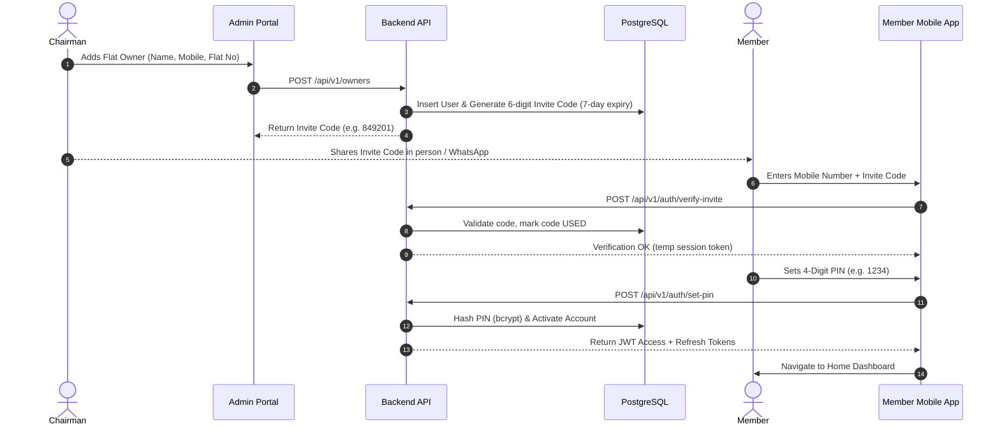
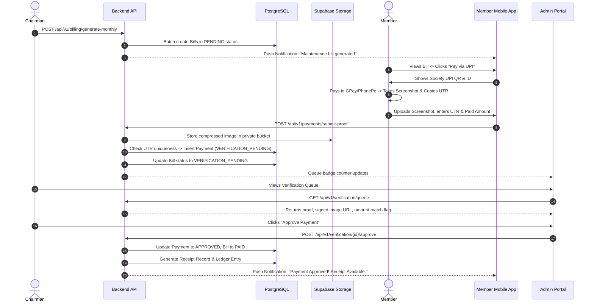
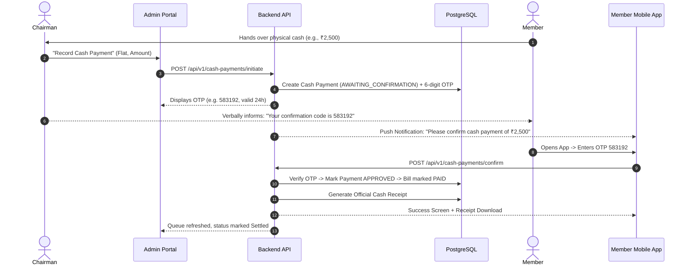
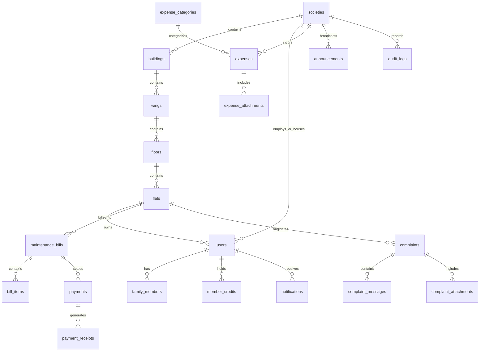

# Technical Specification: Society & Building Maintenance Management System
**Document Version:** 1.0.0  
**Phase:** Phase 0 — Architecture & System Specification  
**Status:** Under Review (Awaiting User Sign-off Before Code Implementation)  
**Target Architecture:** Monorepo / Multi-package (Admin Web + Member App + Unified Node.js API)  
**Database:** PostgreSQL (Supabase Free Tier) | **Storage:** Supabase Storage (Private Bucket)

---

## 1. Executive Summary & Product Overview

The **Society & Building Maintenance Management System** is a unified, zero-overhead digital management platform built specifically for residential societies and apartment complexes. The platform bridges the operational gap between society administration (the Chairman) and flat owners (Members) without incurring ongoing operational costs for SMS, OTPs, or paid SaaS services.

The system consists of two purpose-built frontends backed by a single central REST API:
1. **Admin Web Portal (React.js + Vite + Tailwind CSS):** Designed for the Chairman. Delivers end-to-end administration: building structure hierarchy, flat registry, member lifecycle, automated monthly billing, manual UPI verification queue, cash OTP settlement, complaint management, expense tracking with proof, push announcements, and audit logging.
2. **Member Mobile App (React Native + Expo - Plain JavaScript):** Designed for Flat Owners (iOS & Android). Delivers a frictionless consumer experience: checking dues, generating UPI payment prompts with society QR codes, uploading payment screenshots & UTRs, verifying cash payments via OTP, raising photo+caption complaints, tracking complaints, viewing shared financial statements, and receiving urgent broadcast notices.

### Key Foundational Directives
- **Zero Ongoing Operational Cost:** No SMS gateways, no paid authentication platforms, and no paid push notification tiers. Auth uses Chairman passwords and single-use 6-digit Owner Invite Codes + 4-digit PINs; notifications use free-tier Expo Push.
- **Backend as the Single Source of Truth:** Frontends are presentation and input layers only. All state transitions, late fees, credit allocations, duplicate validations, and permission checks are strictly executed by the Node.js/Express API.
- **Integer Paise Financial Precision:** All monetary amounts are handled and stored as integers in **paise** ($1\text{ INR} = 100\text{ paise}$) to prevent floating-point rounding errors.
- **Architectural Multi-Tenancy:** Every database table representing society assets, people, or transactions is scoped with a mandatory `society_id` and indexed accordingly.

---

## 2. Assumptions & Gap Analysis (Explicit Missing Requirements)

To eliminate architectural ambiguity, the following assumptions and resolved requirements are established:

### 2.1 Explicit Assumptions
1. **Tenancy Model:** The application is architected as multi-tenant from Day 1 (`society_id` on all tenant tables), but deployed initially for a single society instance.
2. **Role Simplicity:** Only two UI roles exist in Phase 1: `CHAIRMAN` and `OWNER`. Future committee roles (`SECRETARY`, `TREASURER`, `AUDITOR`) are supported via an underlying database `role` enum, but hidden in the UI.
3. **Flat Ownership & Login Mapping:** Each flat maps to exactly **one primary owner login**. Family members can be added by the owner for record-keeping, but do not receive independent login credentials. Tenants are recorded as metadata notes on the flat entity without login access.
4. **Ownership Transfers:** When a flat is sold or transferred, the existing owner account is deactivated (preserving all historical bills, payments, and complaint records attached to the flat). A fresh 6-digit invite code is issued to onboard the new owner.
5. **No Payment Gateway in MVP:** Money never flows through the backend API directly. Payments occur externally via UPI apps or in-person cash. The backend manages the verification lifecycle.
6. **Free-tier Supabase Guardrails:**
   - **Database Storage (500 MB):** Schema uses compact types (`uuid`/`bigint`, integer paise, indexed foreign keys).
   - **File Storage (1 GB):** Strict client-side compression reduces image payloads to 200–500 KB before upload.
   - **Idle Pause Mitigation:** A free scheduled GitHub Actions cron executes a `/api/v1/health` ping every 5 days to prevent the 7-day Supabase inactivity pause.
   - **Backup Plan:** A documented weekly `pg_dump` CLI script is provided for the Chairman to download offline backups.

### 2.2 Gap Analysis & Resolved Design Decisions
| # | Identified Ambiguity / Gap | Resolved Architectural Decision |
|---|---------------------------|----------------------------------|
| 1 | Flat vacancy vs billing | Vacant flats are billed identically to occupied flats; maintenance is an asset liability payable by the registered owner. |
| 2 | Partial payments & allocation | If an owner pays less than the total bill, the payment is verified, the bill status moves to `PARTIALLY_PAID`, and remaining balance stays overdue. Partial payments allocate against oldest arrears first. |
| 3 | Overpayment handling | If an owner pays more than the due amount, the excess is credited to `member_credits` and automatically deducted as a discount/credit item on the next generated bill. |
| 4 | Duplicate UTR submission | UTR is enforced with a unique constraint per society: `UNIQUE(society_id, utr)`. Attempts to resubmit an existing UTR are blocked immediately with `HTTP 409 Conflict`. |
| 5 | Cash OTP Expiry & Rate Limit | Cash OTP is 6 digits, single-use, expires in 24 hours, and locks after 5 incorrect attempts to prevent brute-force confirmation. |
| 6 | File Access Control | Uploaded assets (receipts, complaint photos, payment screenshots, bills) are stored in private Supabase buckets. Frontends receive short-lived (15-minute) HMAC-signed URLs generated by the backend API. |
| 7 | Soft Deletes vs Audit Logs | Financial entities (bills, payments, receipts, credits) are never deleted. Non-financial entities support `deleted_at` soft deletion. All updates and state transitions generate immutable records in `audit_logs`. |

---

## 3. User Roles & RBAC Matrix

| Functional Module | Chairman (Web Portal) | Owner (Mobile App) | Unauthenticated / Public |
|---|:---:|:---:|:---:|
| Society Structure (Buildings, Wings, Flats) | Create, Read, Update, Delete | Read Only (Own Flat context) | Denied |
| Owner Management & Invite Generation | Create, Read, Update, Regenerate | Read Only (Self Profile) | Denied |
| Maintenance Bill Generation & Templates | Full Control (Create, Cancel, List) | Read Only (Own Flat Bills) | Denied |
| UPI Payment Proof Submission | Review, Approve, Reject | Submit Proof (Own Bills only) | Denied |
| Cash Payment Processing | Initiate Cash + View OTP | Verify & Submit OTP | Denied |
| Payment Receipts | Generate, View All, Download | View & Download (Own Receipts) | Denied |
| Complaints | View All, Reply, Resolve | Create (Own Flat), Reply, Reopen | Denied |
| Expenses & Invoices | Create, Edit, View All + Proofs | View (Subject to Visibility Policy) | Denied |
| Announcements & Broadcasts | Create, Edit, Expire, Push | View Active, Receive Push | Denied |
| Push Notification Tokens | Send targeted/broadcast | Register device push token | Denied |
| Audit Logs & Financial Reports | Full Access | Denied | Denied |

---

## 4. Feature Breakdown by Phase

### Phase 1 — MVP (Immediate Build Target)
- **Authentication & Onboarding:**
  - Chairman email/mobile + bcrypt password login with rate limiting.
  - Owner onboarding via Chairman-generated 6-digit invite code $\rightarrow$ 4-digit PIN setup $\rightarrow$ mobile + PIN login.
  - JWT access tokens (15-min) + secure rotating refresh tokens (7-day).
- **Society Hierarchy & Flat Registry:**
  - Dynamic CRUD for Buildings $\rightarrow$ Wings $\rightarrow$ Floors $\rightarrow$ Flats.
  - Owner attachment, invite code generation/regeneration, owner deactivation.
- **Maintenance Billing Engine:**
  - Per-flat monthly bill templates (base maintenance, fixed add-ons).
  - One-click monthly batch bill generation.
  - Late fee calculation (flat or monthly percentage after grace period).
  - Bill states: `DRAFT`, `PENDING`, `VERIFICATION_PENDING`, `PARTIALLY_PAID`, `PAID`, `REJECTED`, `OVERDUE`, `CANCELLED`.
- **UPI Proof Verification Workflow:**
  - Mobile display of Society UPI ID + QR code.
  - Screenshot upload + mandatory UTR + amount input $\rightarrow$ `VERIFICATION_PENDING`.
  - Chairman verification queue with side-by-side screenshot viewer, amount-match comparison, Approve / Reject with reason.
  - Overpayment $\rightarrow$ credit ledger; Underpayment $\rightarrow$ partial settlement.
- **In-Person Cash Settlement Protocol:**
  - Chairman records cash entry $\rightarrow$ system generates 24-hr single-use 6-digit OTP.
  - Member receives in-app confirmation modal, enters verbal OTP $\rightarrow$ Bill marks `PAID`.
- **Receipts:**
  - Automated PDF receipt generation and storage with download link.
- **Defaulter & Reminder Engine:**
  - Automatic push notification reminders (3 days before due, on due date, weekly overdue).
  - 3+ months unpaid flag $\rightarrow$ Defaulter status badge & dedicated Chairman Defaulter list.
- **Complaints Feed:**
  - Member photo + caption submission with category tag.
  - Unified message thread (Member & Chairman).
  - State machine: `OPEN` $\rightarrow$ `RESOLVED` $\rightleftharpoons$ `REOPENED`.
- **Broadcast Announcements:**
  - General, Maintenance, Emergency notices with priority flags and push delivery.
- **Expense Logging & Proof:**
  - Chairman entry of expenses with vendor, invoice number, category, and bill photos.
  - Member visibility policy (`PRIVATE`, `SUMMARY`, `DETAILED`).
- **Audit Logging & Dashboard:**
  - Chairman dashboard: Fund balance, collections, pending, overdue, defaulter roster, daily reconciliation strip.
  - Append-only audit logging for all mutations.

### Phase 2 Scope (Post-MVP)
- Parking slot allocation & vehicle records.
- Events management & RSVP / registrations.
- Facility booking with conflict-free slot reservation transactions.
- Society Document repository with role-based signed URL access.
- Member financial report requests & approval flow.
- Special collections / reconstruction fund drives with progress tracking.
- CSV / Excel / PDF exports for reconciliation and accounting.

### Phase 3 Scope (Future)
- Payment Gateway integration (Razorpay / Cashfree) with webhook auto-reconciliation.
- Multi-channel notification dispatchers (Email via Resend, SMS, WhatsApp Business API).
- Sub-committee roles in UI (Treasurer, Secretary, Auditor).
- Automated AI complaint tagging & image triage.

---

## 5. Navigation & Information Architecture

```
Admin Web Portal (Desktop/Tablet First)
├── Dashboard (Reconciliation, Cards, Defaulter Strip, Quick Actions)
├── Society Structure
│   ├── Buildings & Wings
│   ├── Floors & Flats
│   └── Owners & Invite Codes
├── Maintenance & Billing
│   ├── Bill Generation & Templates
│   ├── All Invoices / Bills
│   ├── Payment Verification Queue (UPI)
│   ├── Cash Payment OTP Registry
│   └── Receipts Archive
├── Complaints Management (Thread View, Status Filter)
├── Society Expenses (Expense List, Invoice Proofs, Policy Settings)
├── Announcements & Notices (Composer, Push Dispatch)
├── Audit Logs (Immutable Activity Log)
└── Settings (Society Profile, UPI ID & QR Code Upload, Late Fee Rules)
```

```
Member Mobile App (Consumer-Grade Bottom Tabs)
├── Tab 1: Home
│   ├── Greeting & Flat Badge
│   ├── Dues / Defaulter Alert Banner
│   ├── Quick Action Buttons (Pay, Complaint, Notices)
│   ├── Recent Announcements Carousel
│   └── Quick Status of Open Complaints
├── Tab 2: Bills & Payments
│   ├── Current Bill Card (Pay Now Button)
│   ├── Payment History & Downloadable Receipts
│   └── Cash OTP Confirmation Action Card (when active)
├── Tab 3: Complaints
│   ├── "New Complaint" Floating Action / Button
│   ├── Active & Resolved Complaint Cards
│   └── Complaint Details & Thread Chat View
└── Tab 4: More
    ├── Profile & Family Members
    ├── Society Announcements Archive
    ├── Shared Financial Reports (Summary / Detailed)
    ├── Emergency Society Contacts (One-tap call)
    └── Logout & Security PIN Change
```

---

## 6. Complete Screen Catalog & UI States

### 6.1 Admin Web Portal (14 Core Screens)
1. **`AUTH_LOGIN`**: Mobile/Email + Password, show/hide password, error handling, rate-limit countdown.
2. **`DASHBOARD`**: Total fund balance, month collection, pending dues, overdue count, defaulter list, daily reconciliation strip, expense category breakdown chart.
3. **`SOCIETY_STRUCTURE`**: Tree-view of buildings, wings, floors, and flats; modal to add wings/flats.
4. **`OWNERS_DIRECTORY`**: Searchable table of flats, owners, phone numbers, invite code generation modal, deactivation switch.
5. **`BILL_TEMPLATES`**: Maintenance configuration per flat size or fixed flat rate, late fee policy setup.
6. **`BILL_GENERATION`**: Batch generation preview screen with total calculated sum and confirmation trigger.
7. **`BILLS_LEDGER`**: Full invoice table with filters (`PENDING`, `OVERDUE`, `PAID`, `CANCELLED`), view invoice breakdown modal.
8. **`VERIFICATION_QUEUE`**: Split-screen view: Left list of pending submissions; Right view showing uploaded screenshot, entered UTR, calculated difference, and Approve / Reject (with reason picker).
9. **`CASH_PAYMENT_ENTRY`**: Flat selector, amount input, receipt generation toggle, displays generated 6-digit OTP with 24-hr countdown timer.
10. **`RECEIPTS_ARCHIVE`**: Searchable archive of all verified receipts, PDF download button.
11. **`COMPLAINTS_BOARD`**: Filterable list by tag and status (`OPEN`, `RESOLVED`, `REOPENED`). Chat thread side-panel with reply input, photo attachments, and "Mark as Resolved" button.
12. **`EXPENSES_MANAGER`**: Expense entry form (date, category, vendor, amount, invoice photo upload) and monthly aggregate list.
13. **`ANNOUNCEMENT_COMPOSER`**: Title, content, image upload, priority selector (`NORMAL`, `IMPORTANT`, `EMERGENCY`), instant push trigger.
14. **`AUDIT_LOG_VIEWER`**: Read-only timeline showing actor, target entity, old/new value diff, timestamp.

### 6.2 Member Mobile App (9 Core Screens)
1. **`APP_AUTH_ONBOARDING`**: Mobile number + 6-digit Invite Code validation $\rightarrow$ Set 4-digit PIN with confirmation.
2. **`APP_AUTH_LOGIN`**: Mobile number + 4-digit PIN pad with biometrics trigger (if supported).
3. **`HOME_TAB`**: Overview dashboard, prominent payment reminder or defaulter warning, recent notices, active complaint ticker.
4. **`BILLS_LIST`**: Active dues and past bill cards showing billing period, base charge, late fee, and payment status badge.
5. **`PAY_UPI_SCREEN`**: Amount input (prefilled with due amount, editable for partial payment), Society UPI ID with copy button, high-resolution QR code, file picker for screenshot, UTR text field, submit button.
6. **`CASH_OTP_MODAL`**: Triggered when a cash payment is initiated by the Chairman. Shows entered amount and 6-digit OTP input for member confirmation.
7. **`COMPLAINTS_LIST`**: List of member's complaints with status pills; Floating Action Button to raise new complaint.
8. **`CREATE_COMPLAINT_SCREEN`**: Camera/gallery image picker, category tag picker, caption/description text field.
9. **`COMPLAINT_THREAD_SCREEN`**: Chat-style history showing original photo/caption, Chairman replies, and "Reopen Issue" button if resolved.

---

## 7. End-to-End User Flows

### Flow 1: Owner Onboarding & First Login


### Flow 2: Maintenance Billing & UPI Payment Verification


### Flow 3: Cash Payment with Member OTP Confirmation


---

## 8. Database Architecture & Schema (PostgreSQL)



### 8.1 DDL Schema Definitions

```sql
-- Enable UUID extension
CREATE EXTENSION IF NOT EXISTS "uuid-ossp";

-- 1. Societies
CREATE TABLE societies (
    id UUID PRIMARY KEY DEFAULT uuid_generate_v4(),
    name VARCHAR(255) NOT NULL,
    registration_number VARCHAR(100),
    address TEXT NOT NULL,
    city VARCHAR(100) NOT NULL,
    state VARCHAR(100) NOT NULL,
    pincode VARCHAR(20) NOT NULL,
    upi_id VARCHAR(100),
    upi_qr_image_url TEXT,
    currency VARCHAR(10) DEFAULT 'INR',
    late_fee_type VARCHAR(20) DEFAULT 'PERCENTAGE', -- 'FLAT', 'PERCENTAGE'
    late_fee_value INTEGER DEFAULT 500, -- 500 paise or 5% (500 bps)
    grace_period_days INTEGER DEFAULT 10,
    created_at TIMESTAMPTZ DEFAULT NOW(),
    updated_at TIMESTAMPTZ DEFAULT NOW()
);

-- 2. Hierarchy: Buildings, Wings, Floors, Flats
CREATE TABLE buildings (
    id UUID PRIMARY KEY DEFAULT uuid_generate_v4(),
    society_id UUID NOT NULL REFERENCES societies(id) ON DELETE CASCADE,
    name VARCHAR(100) NOT NULL,
    created_at TIMESTAMPTZ DEFAULT NOW(),
    deleted_at TIMESTAMPTZ
);
CREATE INDEX idx_buildings_society ON buildings(society_id);

CREATE TABLE wings (
    id UUID PRIMARY KEY DEFAULT uuid_generate_v4(),
    society_id UUID NOT NULL REFERENCES societies(id) ON DELETE CASCADE,
    building_id UUID NOT NULL REFERENCES buildings(id) ON DELETE CASCADE,
    name VARCHAR(100) NOT NULL,
    created_at TIMESTAMPTZ DEFAULT NOW(),
    deleted_at TIMESTAMPTZ
);
CREATE INDEX idx_wings_building ON wings(building_id);

CREATE TABLE floors (
    id UUID PRIMARY KEY DEFAULT uuid_generate_v4(),
    society_id UUID NOT NULL REFERENCES societies(id) ON DELETE CASCADE,
    wing_id UUID NOT NULL REFERENCES wings(id) ON DELETE CASCADE,
    floor_number INTEGER NOT NULL,
    created_at TIMESTAMPTZ DEFAULT NOW()
);
CREATE INDEX idx_floors_wing ON floors(wing_id);

CREATE TABLE flats (
    id UUID PRIMARY KEY DEFAULT uuid_generate_v4(),
    society_id UUID NOT NULL REFERENCES societies(id) ON DELETE CASCADE,
    floor_id UUID NOT NULL REFERENCES floors(id) ON DELETE CASCADE,
    flat_number VARCHAR(50) NOT NULL,
    carpet_area_sqft NUMERIC(8, 2),
    occupancy_status VARCHAR(20) DEFAULT 'OCCUPIED', -- 'OCCUPIED', 'VACANT'
    tenant_note TEXT,
    created_at TIMESTAMPTZ DEFAULT NOW(),
    updated_at TIMESTAMPTZ DEFAULT NOW(),
    deleted_at TIMESTAMPTZ,
    UNIQUE(society_id, flat_number)
);
CREATE INDEX idx_flats_society ON flats(society_id);

-- 3. Users & Auth
CREATE TABLE users (
    id UUID PRIMARY KEY DEFAULT uuid_generate_v4(),
    society_id UUID NOT NULL REFERENCES societies(id) ON DELETE CASCADE,
    flat_id UUID REFERENCES flats(id) ON DELETE SET NULL,
    role VARCHAR(30) NOT NULL DEFAULT 'OWNER', -- 'CHAIRMAN', 'OWNER', 'SECRETARY', 'TREASURER'
    full_name VARCHAR(255) NOT NULL,
    mobile VARCHAR(20) NOT NULL,
    email VARCHAR(255),
    password_hash VARCHAR(255), -- for Chairman
    pin_hash VARCHAR(255),      -- for Member 4-digit PIN
    is_active BOOLEAN DEFAULT TRUE,
    invite_code VARCHAR(10),
    invite_code_expires_at TIMESTAMPTZ,
    expo_push_token TEXT,
    created_at TIMESTAMPTZ DEFAULT NOW(),
    updated_at TIMESTAMPTZ DEFAULT NOW(),
    deleted_at TIMESTAMPTZ,
    UNIQUE(society_id, mobile)
);
CREATE INDEX idx_users_society_mobile ON users(society_id, mobile);
CREATE INDEX idx_users_flat ON users(flat_id);

CREATE TABLE refresh_tokens (
    id UUID PRIMARY KEY DEFAULT uuid_generate_v4(),
    user_id UUID NOT NULL REFERENCES users(id) ON DELETE CASCADE,
    token_hash VARCHAR(255) NOT NULL,
    expires_at TIMESTAMPTZ NOT NULL,
    revoked_at TIMESTAMPTZ,
    created_at TIMESTAMPTZ DEFAULT NOW()
);
CREATE INDEX idx_refresh_tokens_user ON refresh_tokens(user_id);

CREATE TABLE family_members (
    id UUID PRIMARY KEY DEFAULT uuid_generate_v4(),
    user_id UUID NOT NULL REFERENCES users(id) ON DELETE CASCADE,
    name VARCHAR(255) NOT NULL,
    relation VARCHAR(50) NOT NULL,
    created_at TIMESTAMPTZ DEFAULT NOW()
);

-- 4. Billing & Invoices (Integer Paise)
CREATE TABLE bill_templates (
    id UUID PRIMARY KEY DEFAULT uuid_generate_v4(),
    society_id UUID NOT NULL REFERENCES societies(id) ON DELETE CASCADE,
    name VARCHAR(100) NOT NULL,
    base_amount_paise BIGINT NOT NULL,
    description TEXT,
    created_at TIMESTAMPTZ DEFAULT NOW()
);

CREATE TABLE maintenance_bills (
    id UUID PRIMARY KEY DEFAULT uuid_generate_v4(),
    society_id UUID NOT NULL REFERENCES societies(id) ON DELETE CASCADE,
    flat_id UUID NOT NULL REFERENCES flats(id) ON DELETE RESTRICT,
    owner_id UUID NOT NULL REFERENCES users(id) ON DELETE RESTRICT,
    bill_number VARCHAR(50) NOT NULL,
    billing_period_month INTEGER NOT NULL, -- 1 to 12
    billing_period_year INTEGER NOT NULL,  -- e.g. 2026
    base_amount_paise BIGINT NOT NULL,
    additional_charges_paise BIGINT DEFAULT 0,
    late_fee_paise BIGINT DEFAULT 0,
    discount_paise BIGINT DEFAULT 0,
    total_amount_paise BIGINT NOT NULL,
    paid_amount_paise BIGINT DEFAULT 0,
    due_date DATE NOT NULL,
    status VARCHAR(30) NOT NULL DEFAULT 'PENDING',
    -- 'DRAFT', 'PENDING', 'VERIFICATION_PENDING', 'PARTIALLY_PAID', 'PAID', 'REJECTED', 'OVERDUE', 'CANCELLED'
    cancellation_reason TEXT,
    created_at TIMESTAMPTZ DEFAULT NOW(),
    updated_at TIMESTAMPTZ DEFAULT NOW(),
    UNIQUE(society_id, bill_number)
);
CREATE INDEX idx_bills_flat ON maintenance_bills(flat_id);
CREATE INDEX idx_bills_status ON maintenance_bills(status);
CREATE INDEX idx_bills_due_date ON maintenance_bills(due_date);

CREATE TABLE bill_items (
    id UUID PRIMARY KEY DEFAULT uuid_generate_v4(),
    bill_id UUID NOT NULL REFERENCES maintenance_bills(id) ON DELETE CASCADE,
    title VARCHAR(255) NOT NULL,
    amount_paise BIGINT NOT NULL
);

-- 5. Payments, Verification & Receipts
CREATE TABLE payments (
    id UUID PRIMARY KEY DEFAULT uuid_generate_v4(),
    society_id UUID NOT NULL REFERENCES societies(id) ON DELETE CASCADE,
    bill_id UUID NOT NULL REFERENCES maintenance_bills(id) ON DELETE RESTRICT,
    payer_id UUID NOT NULL REFERENCES users(id) ON DELETE RESTRICT,
    payment_method VARCHAR(20) NOT NULL, -- 'UPI', 'CASH'
    amount_paise BIGINT NOT NULL,
    payment_date DATE NOT NULL,
    utr VARCHAR(100), -- Unique for UPI within society
    screenshot_url TEXT,
    remarks TEXT,
    status VARCHAR(30) NOT NULL DEFAULT 'PENDING',
    -- 'PENDING', 'AWAITING_CONFIRMATION', 'APPROVED', 'REJECTED'
    rejection_reason TEXT,
    cash_otp VARCHAR(6),
    cash_otp_expires_at TIMESTAMPTZ,
    cash_otp_attempts INTEGER DEFAULT 0,
    verified_by UUID REFERENCES users(id),
    verified_at TIMESTAMPTZ,
    created_at TIMESTAMPTZ DEFAULT NOW(),
    updated_at TIMESTAMPTZ DEFAULT NOW(),
    CONSTRAINT uq_society_utr UNIQUE NULLS NOT DISTINCT (society_id, utr)
);
CREATE INDEX idx_payments_bill ON payments(bill_id);
CREATE INDEX idx_payments_status ON payments(status);

CREATE TABLE payment_receipts (
    id UUID PRIMARY KEY DEFAULT uuid_generate_v4(),
    society_id UUID NOT NULL REFERENCES societies(id) ON DELETE CASCADE,
    payment_id UUID NOT NULL REFERENCES payments(id) ON DELETE RESTRICT,
    bill_id UUID NOT NULL REFERENCES maintenance_bills(id) ON DELETE RESTRICT,
    receipt_number VARCHAR(50) NOT NULL,
    pdf_url TEXT,
    created_at TIMESTAMPTZ DEFAULT NOW(),
    UNIQUE(society_id, receipt_number)
);

CREATE TABLE member_credits (
    id UUID PRIMARY KEY DEFAULT uuid_generate_v4(),
    society_id UUID NOT NULL REFERENCES societies(id) ON DELETE CASCADE,
    user_id UUID NOT NULL REFERENCES users(id) ON DELETE CASCADE,
    flat_id UUID NOT NULL REFERENCES flats(id) ON DELETE CASCADE,
    amount_paise BIGINT NOT NULL DEFAULT 0,
    updated_at TIMESTAMPTZ DEFAULT NOW(),
    UNIQUE(society_id, user_id, flat_id)
);

-- 6. Complaints & Discussion Thread
CREATE TABLE complaint_tags (
    id UUID PRIMARY KEY DEFAULT uuid_generate_v4(),
    society_id UUID NOT NULL REFERENCES societies(id) ON DELETE CASCADE,
    name VARCHAR(50) NOT NULL,
    created_at TIMESTAMPTZ DEFAULT NOW(),
    UNIQUE(society_id, name)
);

CREATE TABLE complaints (
    id UUID PRIMARY KEY DEFAULT uuid_generate_v4(),
    society_id UUID NOT NULL REFERENCES societies(id) ON DELETE CASCADE,
    flat_id UUID NOT NULL REFERENCES flats(id) ON DELETE CASCADE,
    user_id UUID NOT NULL REFERENCES users(id) ON DELETE CASCADE,
    tag_id UUID REFERENCES complaint_tags(id),
    title VARCHAR(255) NOT NULL,
    status VARCHAR(30) NOT NULL DEFAULT 'OPEN', -- 'OPEN', 'RESOLVED', 'REOPENED'
    resolved_at TIMESTAMPTZ,
    created_at TIMESTAMPTZ DEFAULT NOW(),
    updated_at TIMESTAMPTZ DEFAULT NOW()
);
CREATE INDEX idx_complaints_society_status ON complaints(society_id, status);

CREATE TABLE complaint_messages (
    id UUID PRIMARY KEY DEFAULT uuid_generate_v4(),
    complaint_id UUID NOT NULL REFERENCES complaints(id) ON DELETE CASCADE,
    sender_id UUID NOT NULL REFERENCES users(id) ON DELETE RESTRICT,
    message TEXT NOT NULL,
    created_at TIMESTAMPTZ DEFAULT NOW()
);
CREATE INDEX idx_complaint_messages ON complaint_messages(complaint_id);

CREATE TABLE complaint_attachments (
    id UUID PRIMARY KEY DEFAULT uuid_generate_v4(),
    complaint_id UUID NOT NULL REFERENCES complaints(id) ON DELETE CASCADE,
    message_id UUID REFERENCES complaint_messages(id) ON DELETE CASCADE,
    file_url TEXT NOT NULL,
    created_at TIMESTAMPTZ DEFAULT NOW()
);

-- 7. Expenses & Financial Transparency
CREATE TABLE expense_categories (
    id UUID PRIMARY KEY DEFAULT uuid_generate_v4(),
    society_id UUID NOT NULL REFERENCES societies(id) ON DELETE CASCADE,
    name VARCHAR(100) NOT NULL,
    created_at TIMESTAMPTZ DEFAULT NOW(),
    UNIQUE(society_id, name)
);

CREATE TABLE expenses (
    id UUID PRIMARY KEY DEFAULT uuid_generate_v4(),
    society_id UUID NOT NULL REFERENCES societies(id) ON DELETE CASCADE,
    category_id UUID NOT NULL REFERENCES expense_categories(id) ON DELETE RESTRICT,
    title VARCHAR(255) NOT NULL,
    description TEXT,
    amount_paise BIGINT NOT NULL,
    expense_date DATE NOT NULL,
    vendor_name VARCHAR(255),
    invoice_number VARCHAR(100),
    payment_method VARCHAR(50),
    created_by UUID NOT NULL REFERENCES users(id) ON DELETE RESTRICT,
    created_at TIMESTAMPTZ DEFAULT NOW(),
    updated_at TIMESTAMPTZ DEFAULT NOW()
);
CREATE INDEX idx_expenses_society_date ON expenses(society_id, expense_date);

CREATE TABLE expense_attachments (
    id UUID PRIMARY KEY DEFAULT uuid_generate_v4(),
    expense_id UUID NOT NULL REFERENCES expenses(id) ON DELETE CASCADE,
    file_url TEXT NOT NULL,
    created_at TIMESTAMPTZ DEFAULT NOW()
);

CREATE TABLE financial_transparency_policies (
    id UUID PRIMARY KEY DEFAULT uuid_generate_v4(),
    society_id UUID NOT NULL REFERENCES societies(id) ON DELETE CASCADE,
    visibility_level VARCHAR(20) NOT NULL DEFAULT 'SUMMARY', -- 'PRIVATE', 'SUMMARY', 'DETAILED'
    updated_at TIMESTAMPTZ DEFAULT NOW(),
    UNIQUE(society_id)
);

-- 8. Announcements & Notifications
CREATE TABLE announcements (
    id UUID PRIMARY KEY DEFAULT uuid_generate_v4(),
    society_id UUID NOT NULL REFERENCES societies(id) ON DELETE CASCADE,
    title VARCHAR(255) NOT NULL,
    content TEXT NOT NULL,
    priority VARCHAR(20) NOT NULL DEFAULT 'NORMAL', -- 'NORMAL', 'IMPORTANT', 'EMERGENCY'
    image_url TEXT,
    expires_at TIMESTAMPTZ,
    created_by UUID NOT NULL REFERENCES users(id),
    created_at TIMESTAMPTZ DEFAULT NOW()
);
CREATE INDEX idx_announcements_society ON announcements(society_id);

CREATE TABLE notifications (
    id UUID PRIMARY KEY DEFAULT uuid_generate_v4(),
    society_id UUID NOT NULL REFERENCES societies(id) ON DELETE CASCADE,
    user_id UUID NOT NULL REFERENCES users(id) ON DELETE CASCADE,
    title VARCHAR(255) NOT NULL,
    body TEXT NOT NULL,
    event_type VARCHAR(50) NOT NULL,
    entity_id UUID,
    is_read BOOLEAN DEFAULT FALSE,
    created_at TIMESTAMPTZ DEFAULT NOW()
);
CREATE INDEX idx_notifications_user_read ON notifications(user_id, is_read);

-- 9. Audit Logging (Immutable)
CREATE TABLE audit_logs (
    id UUID PRIMARY KEY DEFAULT uuid_generate_v4(),
    society_id UUID NOT NULL REFERENCES societies(id) ON DELETE CASCADE,
    actor_id UUID REFERENCES users(id) ON DELETE SET NULL,
    action VARCHAR(100) NOT NULL,
    entity VARCHAR(100) NOT NULL,
    entity_id UUID NOT NULL,
    old_value JSONB,
    new_value JSONB,
    ip_address VARCHAR(50),
    user_agent TEXT,
    created_at TIMESTAMPTZ DEFAULT NOW()
);
CREATE INDEX idx_audit_society_entity ON audit_logs(society_id, entity, entity_id);
```

---

## 9. Complete REST API Specification

### 9.1 Standard Envelope Conventions
All endpoints strictly return a consistent JSON response envelope:

**Success Response (HTTP 200, 201):**
```json
{
  "success": true,
  "data": { ... },
  "message": "Operation completed successfully.",
  "meta": {
    "page": 1,
    "limit": 20,
    "total": 142
  }
}
```

**Error Response (HTTP 400, 401, 403, 404, 409, 422, 500):**
```json
{
  "success": false,
  "error": {
    "code": "DUPLICATE_UTR",
    "message": "The transaction UTR has already been submitted for this society.",
    "details": []
  }
}
```

### 9.2 API Endpoints Matrix

#### A. Authentication & Onboarding (`/api/v1/auth`)
| Method | Endpoint | Access | Description |
|---|---|---|---|
| `POST` | `/api/v1/auth/login-chairman` | Public | Login with email/mobile + password $\rightarrow$ returns JWT + sets refresh cookie |
| `POST` | `/api/v1/auth/verify-invite` | Public | Verify 6-digit invite code + mobile $\rightarrow$ returns onboarding ticket |
| `POST` | `/api/v1/auth/set-pin` | Public (Ticket) | Complete member onboarding by setting 4-digit PIN |
| `POST` | `/api/v1/auth/login-owner` | Public | Login with mobile + 4-digit PIN $\rightarrow$ returns JWT + refresh token |
| `POST` | `/api/v1/auth/refresh` | Authenticated | Rotate refresh token and issue new 15-min access token |
| `POST` | `/api/v1/auth/logout` | Authenticated | Revoke refresh token and invalidate session |

#### B. Society & Flats (`/api/v1/societies`, `/api/v1/flats`)
| Method | Endpoint | Access | Description |
|---|---|---|---|
| `GET` | `/api/v1/societies/me` | Authenticated | Get current society details (UPI ID, settings) |
| `PATCH` | `/api/v1/societies/me` | Chairman | Update society profile, UPI ID, QR code, late fee rules |
| `GET` | `/api/v1/flats` | Chairman | Get all flats hierarchical tree |
| `POST` | `/api/v1/flats` | Chairman | Create single flat or batch generate floors/flats |
| `PATCH` | `/api/v1/flats/:id` | Chairman | Update tenant notes, occupancy status, or details |

#### C. Owner Management (`/api/v1/owners`)
| Method | Endpoint | Access | Description |
|---|---|---|---|
| `GET` | `/api/v1/owners` | Chairman | List all registered owners with flat mapping and invite status |
| `POST` | `/api/v1/owners` | Chairman | Register new flat owner $\rightarrow$ generates 6-digit invite code |
| `POST` | `/api/v1/owners/:id/regenerate-invite` | Chairman | Invalidate previous code and generate fresh 7-day invite code |
| `PATCH` | `/api/v1/owners/:id/deactivate` | Chairman | Deactivate owner (flat transfer/sale) |

#### D. Maintenance Billing (`/api/v1/billing`)
| Method | Endpoint | Access | Description |
|---|---|---|---|
| `GET` | `/api/v1/billing/templates` | Chairman | Get billing templates |
| `POST` | `/api/v1/billing/templates` | Chairman | Create or edit monthly billing template |
| `POST` | `/api/v1/billing/generate-monthly` | Chairman | Batch generate monthly bills for all flats |
| `GET` | `/api/v1/billing/bills` | Chairman / Owner | List bills (Owners automatically scoped to own flat) |
| `GET` | `/api/v1/billing/bills/:id` | Chairman / Owner | Get single bill details with line items and payments |
| `POST` | `/api/v1/billing/bills/:id/cancel` | Chairman | Cancel unpaid bill with mandatory reason |

#### E. Payments & Verification (`/api/v1/payments`, `/api/v1/verification`)
| Method | Endpoint | Access | Description |
|---|---|---|---|
| `POST` | `/api/v1/payments/submit-proof` | Owner | Submit screenshot, UTR, amount for a pending bill |
| `GET` | `/api/v1/verification/queue` | Chairman | List all pending payment proofs awaiting verification |
| `POST` | `/api/v1/verification/:paymentId/approve` | Chairman | Approve payment $\rightarrow$ marks bill PAID/PARTIAL, generates receipt |
| `POST` | `/api/v1/verification/:paymentId/reject` | Chairman | Reject payment with predefined reason enum |

#### F. Cash Payments (`/api/v1/cash-payments`)
| Method | Endpoint | Access | Description |
|---|---|---|---|
| `POST` | `/api/v1/cash-payments/initiate` | Chairman | Record cash collection $\rightarrow$ generates 6-digit member OTP |
| `GET` | `/api/v1/cash-payments/active-otp` | Owner | Check if an active cash payment OTP confirmation is pending |
| `POST` | `/api/v1/cash-payments/confirm` | Owner | Submit verbal OTP from app $\rightarrow$ confirms cash payment |

#### G. Complaints (`/api/v1/complaints`)
| Method | Endpoint | Access | Description |
|---|---|---|---|
| `GET` | `/api/v1/complaints` | Chairman / Owner | List complaints (Owners see only own flat) |
| `POST` | `/api/v1/complaints` | Owner | Create new complaint with photo and caption |
| `GET` | `/api/v1/complaints/:id` | Chairman / Owner | Get complaint thread with messages and photos |
| `POST` | `/api/v1/complaints/:id/messages` | Chairman / Owner | Send reply message in thread |
| `PATCH` | `/api/v1/complaints/:id/status` | Chairman / Owner | Update status (`RESOLVED` by Chairman, `REOPENED` by Owner) |

#### H. Expenses & Transparency (`/api/v1/expenses`)
| Method | Endpoint | Access | Description |
|---|---|---|---|
| `GET` | `/api/v1/expenses` | Chairman / Owner | List expenses (Member response filtered by transparency policy) |
| `POST` | `/api/v1/expenses` | Chairman | Create expense with invoice photo and vendor details |
| `GET` | `/api/v1/expenses/summary` | Chairman / Owner | Monthly and category totals |
| `PATCH` | `/api/v1/expenses/policy` | Chairman | Set visibility policy (`PRIVATE`, `SUMMARY`, `DETAILED`) |

#### I. Announcements & Notifications (`/api/v1/announcements`, `/api/v1/notifications`)
| Method | Endpoint | Access | Description |
|---|---|---|---|
| `GET` | `/api/v1/announcements` | Chairman / Owner | List active announcements |
| `POST` | `/api/v1/announcements` | Chairman | Broadcast new notice + trigger Expo push notification |
| `POST` | `/api/v1/notifications/register-token` | Authenticated | Register/update Expo push notification token |
| `GET` | `/api/v1/notifications` | Authenticated | List in-app notifications |
| `PATCH` | `/api/v1/notifications/:id/read` | Authenticated | Mark notification as read |

#### J. Storage & Signed URLs (`/api/v1/storage`)
| Method | Endpoint | Access | Description |
|---|---|---|---|
| `POST` | `/api/v1/storage/upload-url` | Authenticated | Obtain pre-signed upload URL for private bucket |
| `GET` | `/api/v1/storage/signed-url` | Authenticated | Obtain 15-minute HMAC read URL for authorized private asset |

---

## 10. Financial Engine & Payment Verification Architecture

### 10.1 Integer Paise Calculations
Money in the database is strictly integer `paise`.
$$\text{paise} = \text{round}(\text{amount\_in\_inr} \times 100)$$
Example: $\text{₹}2,450.50 \rightarrow 245050\text{ paise}$. All math in backend services uses standard integer arithmetic; division occurs only at final UI rendering.

### 10.2 Payment Allocation & Credit Engine
When a payment $P$ of amount $A$ is verified for bill $B$:
1. Let Due Amount $D = B.\text{total\_amount\_paise} - B.\text{paid\_amount\_paise}$.
2. **Exact Payment ($A = D$):**
   - $B.\text{paid\_amount\_paise} \mathrel{+}= A$
   - $B.\text{status} \leftarrow \text{PAID}$
3. **Underpayment ($A < D$):**
   - $B.\text{paid\_amount\_paise} \mathrel{+}= A$
   - $B.\text{status} \leftarrow \text{PARTIALLY\_PAID}$
   - Remaining balance $(D - A)$ remains overdue.
4. **Overpayment ($A > D$):**
   - Excess amount $E = A - D$.
   - $B.\text{paid\_amount\_paise} \mathrel{+}= D$
   - $B.\text{status} \leftarrow \text{PAID}$
   - Credit table updated: `member_credits(user_id, flat_id)` balance increased by $E$.
   - On subsequent bill generation, credit $E$ is automatically applied as a negative adjustment item (`discount_paise`), drawing down the credit balance.

### 10.3 Late Fee Application Algorithm
Executed by a scheduled automated job on the 1st of each month or on-demand:
```javascript
// Pseudocode for Late Fee calculation
for (const bill of overdueBills) {
  const daysOverdue = differenceInDays(today, bill.due_date);
  if (daysOverdue > society.grace_period_days && bill.late_fee_paise === 0) {
    let feePaise = 0;
    if (society.late_fee_type === 'FLAT') {
      feePaise = society.late_fee_value; // e.g. 20000 = ₹200
    } else if (society.late_fee_type === 'PERCENTAGE') {
      // 5% per month = 500 basis points
      feePaise = Math.round((bill.base_amount_paise * society.late_fee_value) / 10000);
    }
    bill.late_fee_paise = feePaise;
    bill.total_amount_paise += feePaise;
    await bill.save();
  }
}
```

---

## 11. File Storage & Compression Pipeline

To ensure the system never exceeds the **1 GB Supabase free storage ceiling**, all photo uploads follow a strict client-side compression pipeline:

```
Camera / Gallery Picker
        │
        ▼
Client-Side Image Compression
(expo-image-manipulator / browser canvas)
Max Dimension: 1600px | Quality: 0.72 | Target Size: 200KB - 400KB
        │
        ▼
Pre-Signed Upload URL Request (API /api/v1/storage/upload-url)
- Backend verifies user auth & creates random UUID filename
- Returns signed upload token for private bucket
        │
        ▼
Direct HTTP PUT to Supabase Storage Bucket ('society-private-vault')
        │
        ▼
Private Path Saved in Database (e.g. "complaints/soc_1/comp_99_img.webp")
        │
        ▼
Read Requests: Backend generates 15-minute expiring HMAC signed URL
```

---

## 12. Notification & Event-Driven Architecture

### Zero-Cost Push Architecture
The notification system is decoupled through a central Node.js Event Emitter:

```
Business Event Triggered
(e.g., Bill Generated, Payment Approved, Announcement Created)
                   │
                   ▼
       Notification Event Emitter
                   │
         ┌─────────┴─────────┐
         ▼                   ▼
Database Insert         Channel Dispatcher (Strategy Pattern)
(In-App Notification)        │
                             ├─► Expo Push Sender (Free MVP Transport)
                             ├─► [Phase 3] Resend Email Adapter
                             └─► [Phase 3] WhatsApp / SMS Adapter
```

**Expo Push Notification Payload Structure:**
```json
{
  "to": "ExponentPushToken[xxxxxxxxxxxxxxxxxxxxxx]",
  "sound": "default",
  "title": "Maintenance Bill Generated",
  "body": "Your maintenance bill for October 2026 of ₹2,500 is now ready.",
  "data": {
    "screen": "BILLS_TAB",
    "billId": "a5d892e1-4c28-40a1-a67b-b892301df228"
  }
}
```

---

## 13. Audit Logging & Compliance Engine

Audit logs are strictly **append-only** and enforced via database constraints and API design.

### Monitored Mutation Events:
1. `USER_INVITE_GENERATED` / `USER_PIN_SET` / `USER_DEACTIVATED`
2. `BILL_BATCH_GENERATED` / `BILL_CANCELLED`
3. `PAYMENT_PROOF_SUBMITTED`
4. `PAYMENT_VERIFIED_APPROVED` / `PAYMENT_VERIFIED_REJECTED`
5. `CASH_OTP_GENERATED` / `CASH_OTP_CONFIRMED`
6. `COMPLAINT_RESOLVED` / `COMPLAINT_REOPENED`
7. `EXPENSE_CREATED` / `POLICY_CHANGED`

Each audit entry stores:
- `actor_id`: User performing action (or `SYSTEM` for automated cron jobs).
- `action`: Canonical event identifier.
- `entity` & `entity_id`: Target resource.
- `old_value` & `new_value`: JSONB snapshots recording exact state changes.
- `ip_address` & `user_agent`: Request metadata.

---

## 14. Monorepo & Directory Structure

```
Building/
├── package.json                   # Monorepo root scripts & workspaces
├── README.md
├── docs/
│   ├── TECHNICAL_SPECIFICATION.md # This document
│   └── RUNBOOK.md                 # Supabase backup & keep-alive runbook
├── backend/                       # Node.js + Express API
│   ├── package.json
│   ├── .env.example
│   ├── server.js                  # Entry point
│   ├── config/
│   │   ├── database.js            # PostgreSQL connection pool (pg / prisma)
│   │   └── supabase.js            # Supabase storage client initialization
│   ├── controllers/               # Express request handlers
│   │   ├── authController.js
│   │   ├── billingController.js
│   │   ├── cashPaymentController.js
│   │   ├── complaintController.js
│   │   ├── expenseController.js
│   │   ├── ownerController.js
│   │   ├── societyController.js
│   │   └── verificationController.js
│   ├── middleware/
│   │   ├── authMiddleware.js      # JWT verification & token rotation
│   │   ├── rbacMiddleware.js      # Role enforcement
│   │   ├── societyScope.js        # Multi-tenant society_id injector
│   │   └── errorHandler.js        # Unified error envelope
│   ├── models/ / db/              # SQL queries or migration files
│   │   └── schema.sql             # Pure PostgreSQL DDL
│   ├── services/                  # Business logic (isolated from controllers)
│   │   ├── auditService.js
│   │   ├── billingService.js
│   │   ├── notificationService.js
│   │   ├── paymentService.js
│   │   └── storageService.js
│   └── utils/
│       ├── currency.js            # Paise <-> INR converters
│       ├── otpGenerator.js        # Crypto-secure 6-digit OTP
│       └── receiptPdf.js          # PDFKit receipt generator
├── admin-portal/                  # React.js + Vite + Tailwind CSS
│   ├── package.json
│   ├── vite.config.js
│   ├── tailwind.config.js
│   ├── src/
│   │   ├── App.jsx
│   │   ├── main.jsx
│   │   ├── api/                   # Axios client + React Query hooks
│   │   ├── components/            # UI components (Buttons, Modals, Tables)
│   │   ├── context/               # AuthContext & SocietyContext
│   │   ├── layouts/               # AdminLayout (Sidebar + Topbar)
│   │   └── pages/                 # 14 Admin Portal Screens
├── member-app/                    # React Native + Expo (Plain JavaScript)
│   ├── package.json
│   ├── app.json
│   ├── App.js                     # Root component
│   ├── src/
│   │   ├── api/                   # Axios API services
│   │   ├── components/            # Clean mobile UI widgets
│   │   ├── context/               # Auth & Push Token context
│   │   ├── navigation/            # React Navigation Bottom Tabs & Stacks
│   │   ├── screens/               # 9 Member App Screens
│   │   └── utils/                 # SecureStore helpers, Image compressor
└── .github/
    └── workflows/
        └── keep-alive.yml         # Free weekly ping cron for Supabase
```

---

## 15. Testing & Quality Assurance Strategy

1. **Unit Testing:**
   - Financial calculation logic (Paise arithmetic, partial payment distribution, overpayment credit math, late fee logic).
   - OTP and Invite code expiration and rate-limiting validators.
2. **Integration Testing:**
   - Supertest API test suites verifying all `/api/v1` routes.
   - UTR duplicate constraint testing (`409 Conflict`).
   - Cross-tenant data isolation testing (ensuring Owner A from Society 1 cannot access Flat B from Society 2).
3. **Manual Acceptance Verification:**
   - Onboarding flow with 6-digit invite code and PIN setup.
   - End-to-end UPI payment proof submission and side-by-side Chairman verification.
   - End-to-end Cash payment OTP generation and confirmation.

---

## 16. Deployment & DevOps Architecture (Zero-Cost Tier)

```
                    +-----------------------+
                    |    GitHub Repository   |
                    +-----------+-----------+
                                |
             +------------------+------------------+
             |                                     |
   (Admin Web & Backend)                   (Member Mobile App)
             |                                     |
   Render / Railway / Vercel                 Expo Application
       (Free Hobby Tier)                    Services (EAS Build)
             |                                     |
+------------v------------+              +---------v---------+
| Node.js REST API Server |              | Android APK / iOS |
|  & React Admin Portal   |              | Ad-Hoc Simulator  |
+------------+------------+              +---------+---------+
             |                                     |
             +------------------+------------------+
                                |
                    +-----------v-----------+
                    |   Supabase Free Tier   |
                    | 500MB PostgreSQL DB   |
                    | 1GB Private Storage   |
                    +-----------------------+
```

### Free-Tier Maintenance Runbook:
- **Supabase Idle Prevention:** `.github/workflows/keep-alive.yml` scheduled every 5 days:
  ```yaml
  name: Supabase Keep-Alive Ping
  on:
    schedule:
      - cron: '0 0 */5 * *'
    workflow_dispatch:
  jobs:
    ping:
      runs-on: ubuntu-latest
      steps:
        - name: Ping API Health Endpoint
          run: curl -s -f https://<YOUR_DEPLOYED_BACKEND_URL>/api/v1/health || exit 0
  ```
- **Weekly Offline Database Dump:**
  Chairman or developer runs:
  ```bash
  pg_dump -h db.<PROJECT_ID>.supabase.co -U postgres -d postgres -F c -b -v -f society_backup_$(date +%Y%m%d).dump
  ```

---

## 17. Development Sequence (Phased Roadmap)

```
[ Phase 0: Technical Specification ] <--- WE ARE HERE
      | (Awaiting User Sign-off)
      v
[ Phase 1.1: Backend Foundations ]
      - PostgreSQL DDL setup on Supabase
      - Express server boilerplate, error envelopes, and CORS
      - Auth Service: Chairman login + Owner Invite Code & PIN verification
      - JWT + rotating refresh token middleware
      v
[ Phase 1.2: Core Domain Services ]
      - Society & Flat hierarchy APIs
      - Maintenance billing generator & late fee calculation engine
      - Supabase Storage pre-signed upload & download integration
      - UPI proof submission & Chairman verification queue
      - Cash OTP generation & confirmation lifecycle
      - PDF receipt generation
      v
[ Phase 1.3: Communication & Support ]
      - Complaint thread messages + status management
      - Announcements + Expo Push notification dispatcher
      - Expense logging + transparency policies
      - Audit log engine
      v
[ Phase 1.4: Admin Web Portal (React.js) ]
      - Vite + Tailwind setup with desktop/tablet-first layout
      - Auth & Session state
      - Society structure & Owner management screens
      - Billing, Verification Queue & Cash Settlement screens
      - Complaints, Expenses, Announcements & Audit Log screens
      v
[ Phase 1.5: Member Mobile App (React Native + Expo) ]
      - Expo project init (Plain JavaScript)
      - Mobile auth: Invite code + PIN pad
      - Home dashboard with dues banner & notifications
      - Pay Maintenance (UPI QR display, screenshot upload, UTR entry)
      - Cash OTP confirmation modal
      - Complaint creation & interactive thread chat
      v
[ Phase 1.6: System Verification & Hardening ]
      - End-to-end integration tests & permission audits
      - Keep-alive GitHub workflow setup
      - Phase 1 MVP Completion Sign-off
```

---
**End of Technical Specification.**
